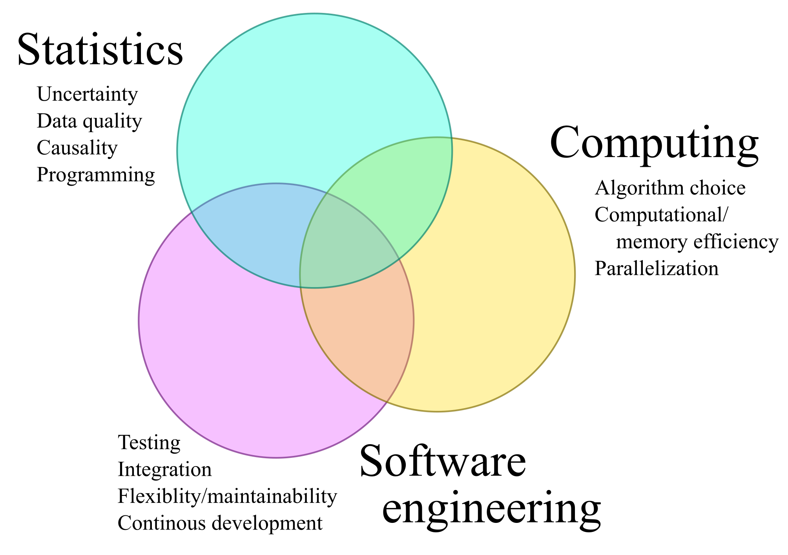
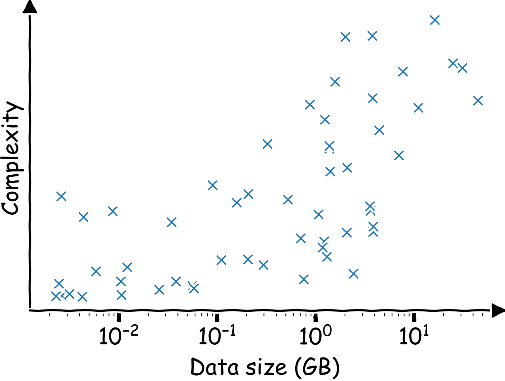

# Software eng/Computing: increasingly  $\hspace{8em}$ relevant skills

![:vspace -5ex]

---

# "Big data" are complex data

---

# Keep learning, achieve more

<blockquote>

Knowledge and productivity are like compound interest. ....
 
 
The more you know, the more you learn; the more you learn, the more you can do; the more you can do, the more the opportunity - it is very much like compound interest.

</blockquote>

 &mdash; Richard Hamming 

---
class: center, middle, inverse

# Verbum sap (= enough said)

## Thank you for taking the class!