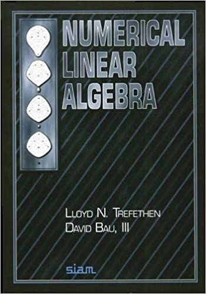

```{r setup, include = FALSE}
required_packages <- c('MASS')
for (pkg in required_packages) {
  if (!(pkg %in% rownames(installed.packages()))) {
    install.packages(pkg)
  }
  library(pkg, character.only = TRUE)
}
source("../R/colors.R")
```

# Floating point numbers

Example: 64-bits double-precision number

```{r, echo=FALSE, eval=TRUE, fig.retina=1}
knitr::include_graphics("figure/double_precision_number.png")
```

52-bits fraction:<br>
$\qquad$ 10110... = 1/2 + 0/4 + 1/8 + 1/16 + 0/32 + ...

--

```{r, eval=TRUE}
c((1 + 2^(-52)) - 1, 
  (1 + 2^(-53)) - 1)
```

---

# Floating point numbers

Example: 64-bits double-precision number

```{r, echo=FALSE, eval=TRUE, fig.retina=1}
knitr::include_graphics("figure/double_precision_number.png")
```

11-bits exponent:<br>
$\qquad$ $2^{11} = 2048$, covering −1022 to +1023

--

```{r, eval=TRUE}
c(2^(1023), 2^(1024), 2^(-1022 - 52), 2^(-1023 - 52))
```

---

# Floating point numbers

Example: 64-bits double-precision number

```{r, eval=TRUE}
c(.Machine$double.xmax, .Machine$double.eps)
```

--

```{r, eval=TRUE}
log(.Machine$double.xmax)
c(exp(709), exp(710))
```

---

# Floating point numbers

Example: multinomial logit in double-precision

```{r}
n_obs <- 5 # just to save memory
n_pred <- 10^6
n_category <- 3

set.seed(140850)
X <- matrix(
  rnorm(n_obs * n_pred), 
  n_obs, n_pred
)
reg_coef <- matrix(
  rnorm(n_pred * n_category), 
  n_pred, n_category
)

log_category_prob <- as.vector(X[1, ] %*% reg_coef)
category_prob <- exp(log_category_prob) / sum(exp(log_category_prob))
```
--
<p style="margin-top:-1.5ex;"> </p>
```{r}
category_prob
```
---

# Floating point numbers

Example: multinomial logit in double-precision

```{r}
n_obs <- 5 # just to save memory
n_pred <- 10^6
n_category <- 3

set.seed(140850)
X <- matrix(
  rnorm(n_obs * n_pred), 
  n_obs, n_pred
)
reg_coef <- matrix(
  rnorm(n_pred * n_category), 
  n_pred, n_category
)

log_category_prob <- as.vector(X[1, ] %*% reg_coef)
category_prob <- exp(log_category_prob) / sum(exp(log_category_prob))
log_category_prob
```

---

# Floating point numbers

## Example: accuracy of numerical gradient

Numerical differentiation is one practical situation in which you clearly observe an effect of finite-precision.

--

Taylor's theorem tells us that
$$f(x + \Delta x) = f(x) + \Delta x f'(x) + \frac{(\Delta x)^2}{2} f''(x) + \ldots.$$

--

So we can approximate $f'(x)$ using the relation
$$\frac{f(x + \Delta x) - f(x)}{\Delta x} \approx f'(x) + O(\Delta x).$$
---

# Floating point numbers

## Example: accuracy of numerical gradient
But we can do better; note that
.small[$$f(x + \Delta x) = f(x) + \Delta x f'(x) + \frac{(\Delta x)^2}{2} f''(x) + \frac{(\Delta x)^3}{6} f'''(x) + \ldots$$]
.small[$$f(x - \Delta x) = f(x) - \Delta x f'(x) + \frac{(\Delta x)^2}{2} f''(x) - \frac{(\Delta x)^3}{6} f'''(x) + \ldots$$]

--

So we have 
$$\frac{f(x + \Delta x) - f(x - \Delta x)}{2 \Delta x} \approx f'(x) + O((\Delta x)^2),$$
which is called _centered difference approximation_.

---

# Floating point numbers

## Example: accuracy of numerical gradient
We can extend the idea to get higher-order estimates e.g.
.small[$$\frac{- f(x + 2 \Delta x) + 8 f(x + \Delta x) - 8 f(x - \Delta x) + f(x - 2 \Delta x)
  }{12 \Delta x} 
  = f'(x) + O((\Delta x)^4).$$]

--

BUT these higher-order methods aren't really practical.
(You will find out one major reason in the homework.)

--

**Note:** For functions with multivariate inputs, we have 
$f(\bx + \Delta x \, \bm{e}_i) = f(\bx) + \Delta x \, \partial_i f(\bx) + \ldots$.

---
class: inverse, middle, center

# (ill)conditing and numerical (in)stability

---

# Example: Gaussian process regression

Let's first review a property of multivariate Gaussian.

--

**Fact:** The conditional distribution of 
$$\begin{bmatrix} \by_1 \\ \by_2 \end{bmatrix} 
  \sim \normalDist \left(
    \begin{bmatrix} \bm{\mu}_1 \\ \bm{\mu}_2 \end{bmatrix},
    \begin{bmatrix} \bSigma_{11} & \bSigma_{12} \\ 
    \bSigma_{21} & \bSigma_{22} \end{bmatrix}
  \right)$$
is given by
$$\by_1 \given \by_2
  \sim \normalDist\left( 
    \bm{\mu}_1 + \bSigma_{12} \bSigma_{22}^{-1} (\by_2 - \bm{\mu}_2),  
    \bSigma_{11} - \bSigma_{12} \bSigma_{22}^{-1} \bSigma_{21}
  \right).$$

---

# Example: Gaussian process regression

_Gaussian process_ $\, y(\bm{s}): \mathbb{R}^d \to \mathbb{R}$ is a Bayesian non-parametric prior for an unknown function.

--

```{r, echo=FALSE, eval=TRUE, out.width="100%"}
knitr::include_graphics("figure/gp_regression_prior_posterior_prediction.png")
```

--

Its defining propety is that $\left( y(\bm{s}_1), \ldots, y(\bm{s}_n) \right)$ is multivariate Gaussian for any set of $\bm{s}_1, \ldots, \bm{s}_n$.

---

# Example: Gaussian process regression

Besides $\mu(\bm{s}) = \mathbb{E}(y(\bm{s}))$, the _covariance function_ 
$$k(\bm{s}, \bm{s}') = \textrm{cov}(y(\bm{s}), y(\bm{s}'))$$ 
characterizes GP's behavior.
<!-- More formally, a covariance function is a semi-positive definite symmetric kernel. -->

--

<p style="margin-top:3ex;"> </p>
**Example:** Squared exponential covariance

$$k(\bm{s}, \bm{s}') = \sigma^2 \prod_i \exp\left(- \frac{(s_i - s_i')^2}{2 \ell_i^2} \right)$$
where $\ell_i$'s are _range_ parameters.

???

A covariance function essentially measures similarity (or inverse distance) between two points $\bm{s}$ and $\bm{s}'$.

The multiplication by $\bm{\Sigma}_{12}$ is reminiscent of kernel density smoothing.

<!-- Matern covariance with smoothness $\nu = 5/2$: -->
<!-- $$k_{5/2}(r) = \left( -->
<!--   1 + \frac{\sqrt{5} r}{\ell} + \frac{5 r^2}{3 \ell^2}\right) \exp\left(- \frac{\sqrt{5} r}{\ell}  -->
<!-- \right)$$ -->
<!-- Eq (4.17) in Rasmussen and Williams. -->

<!-- matern_cov <- function(dist, range) { -->
<!--   scaled_dist <- dist / range -->
<!--   return( -->
<!--     (1 + sqrt(5) * scaled_dist + 5 / 3 * scaled_dist^2)  -->
<!--     * exp(- sqrt(5) * scaled_dist) -->
<!--   ) -->
<!-- } -->

---

# Example: Gaussian process regression

Now let's see GP in action. Say we observe a function over a grid with "gap" and want to fill it in:

```{r, echo=FALSE}
sq_exp_cov <- function(dist, range) {
  return(exp(-(dist / range)^2))
}
```

```{r, echo=FALSE, fig.dim=c(8, 5), fig.retina=2, fig.align='center'}
loc_obs <- c(seq(0, .4, .01), seq(.6, 1, .01))
n_obs <- length(loc_obs)

set.seed(2021)
corr_range <- .2
dist_obs <- as.matrix(dist(loc_obs))
Sigma_obs <- sq_exp_cov(dist_obs, corr_range)
y_obs <- mvrnorm(mu = rep(0, n_obs), Sigma = Sigma_obs)
par(mar = c(4.1, 4.1, 0, 0))
plot(loc_obs, y_obs, xlab="s", ylab="y(s)", 
     cex=1.8, cex.lab=1.8, cex.axis=1.8, 
     col=jhu_color$spiritBlue, frame.plot = F)
```

---

# Example: Gaussian process regression

Here's how we simulated a function from a GP with squared exponential covariance in the previous plot:

```{r, eval=FALSE}
sq_exp_cov <- function(dist, range) {
  return(exp(-(dist / range)^2))
}

loc_obs <- c(seq(0, .4, .01), seq(.6, 1, .01))
n_obs <- length(loc_obs)

set.seed(2021)
corr_range <- .2
dist_obs <- as.matrix(dist(loc_obs))
Sigma_obs <- sq_exp_cov(dist_obs, corr_range)
y_obs <- mvrnorm(mu = rep(0, n_obs), Sigma = Sigma_obs)
plot(loc_obs, y_obs)
```

---

# Example: Gaussian process regression

```{r wrap-error, echo=FALSE}
error_hook <- knitr::knit_hooks$get("error")
knitr::knit_hooks$set(error = function(x, options) {
  if (!is.null(n <- options$linewidth)) {
    x = knitr:::split_lines(x)
    if (any(nchar(x) > n)) x = strwrap(x, width = n)
    x = paste(x, collapse = '\n')
  }
  error_hook(x, options)
})
```

Let's now try to interpolate the function:

```{r}
#' Compute the conditional mean of `y_1` given `y_2`
gauss_conditional_mean <- function(y_2, mu_1, mu_2, cov_12, cov_22) {
  return(mu_1 + cov_12 %*% solve(cov_22, y_2 - mu_2))
}
```

---

# Example: Gaussian process regression

Let's now try to interpolate the function:

```{r, eval=FALSE}
loc_new <- seq(.41, .59, .01)
n_new <- length(loc_new)

dist_new <- as.matrix(dist(loc_new))
Sigma_new <- sq_exp_cov(dist_new, corr_range)
cross_dist <- as.matrix(dist(c(loc_new, loc_obs)))
cross_dist <- cross_dist[1:n_new, (n_new + 1):(n_new + n_obs)]
Sigma_cross <- sq_exp_cov(cross_dist, corr_range)
mean_obs <- rep(0, n_obs)
mean_new <- rep(0, n_new)
```

--

Ready, set, ...
```{r, eval=FALSE}
y_predicted <- gauss_conditional_mean(y_obs, mean_new, mean_obs, Sigma_cross, Sigma_obs)
```

---

# Example: Gaussian process regression

Let's now try to interpolate the function:

```{r}
loc_new <- seq(.41, .59, .01)
n_new <- length(loc_new)

dist_new <- as.matrix(dist(loc_new))
Sigma_new <- sq_exp_cov(dist_new, corr_range)
cross_dist <- as.matrix(dist(c(loc_new, loc_obs)))
cross_dist <- cross_dist[1:n_new, (n_new + 1):(n_new + n_obs)]
Sigma_cross <- sq_exp_cov(cross_dist, corr_range)
mean_obs <- rep(0, n_obs)
mean_new <- rep(0, n_new)
```

Ready, set, ... go! (Oops.)
```{r, error=TRUE, linewidth=70}
y_predicted <- gauss_conditional_mean(y_obs, mean_new, mean_obs, Sigma_cross, Sigma_obs)
```

---

# Conditioning of problem

Think of a _problem_, machine implementation of which is an _algorithm_, as a map: $\, x \to f(x)$ (e.g. $\boldsymbol{x} \to \boldsymbol{A}^{-1} \boldsymbol{x}$).

--

**Question:** How sensitive is a problem $f(x)$ to small perturbation in the input $x$?

--

Measure of this sensitivity is called a _condition number_.

--

<p style="margin-top:4ex;"> </p>
## Example of why we might care about this:
* Say $\boldsymbol{x} + \boldsymbol{\delta x}$ is a machine representation of $\boldsymbol{x}$.
* How far away is $\boldsymbol{A}^{-1} (\boldsymbol{x} + \boldsymbol{\delta x})$ from $\boldsymbol{A}^{-1} \boldsymbol{x}$?

---

# Condition number

_Relative condition number_ is defined as

$$\kappa := \lim_{\| \bdelta \bx \| \to 0} \sup_{\bdelta \bx} 
\frac{
  \| \bf(\bx + \bdelta \bx) - \bf(\bx) \| / \| \bf(\bx) \|
  }{
  \| \bdelta \bx \| / \| \bx \|
},$$
where $\| \bx \| = \left( \sum_i x_i^2 \right)^{1/2}$ is the $\ell^2$-norm.  

--

We say a problem is _well-conditioned_ if $\kappa$ is small (e.g. $\kappa \lesssim 10^2$) and _ill-conditioned_ if $\kappa$ large (e.g. $\kappa \gtrsim 10^6$).

--

In particular, when $\kappa \approx 10^{16} \approx (\text{machine prec})^{-1}$, no algorithm can guarantee a meaningful result.

---

# Condition number

## Example of ill-conditioned problem: eigenvalues of non-symmetric matrices
Eigenvalues of
$\begin{bmatrix} 1 & 10^{16} \\ 0 & 1 \end{bmatrix}$ 
are {1, 1}. 

--

But those of $\begin{bmatrix} 1 & 10^{16} \\ 10^{-16} & 1 \end{bmatrix}$ are {0, 2}. <br>
$\qquad$ (To see this, note that $\lambda_1 \lambda_2 = 0$ and $\lambda_1 + \lambda_2 = 2$.)

--

<p style="margin-top:3ex;">
On the other hands, the eigenvalues of a symmetric matrix are well-conditioned.
</p>

---

# Condition number of a matrix

**Question:** What is the condition number of a matrix-vector multiplication $\bx \to \bA \bx$?

--

First define the _matrix norm_ $\| \bA \| := \max_{\bm{v}} \| \bA \bm{v} \| / \| \bm{v} \|$, corresponding to the largest singular value of $\bA$.

<!-- TODO: Consider spending a bit more time explaining the matrix norm.  -->
<!-- Or, the condition number can be explained as the ratio of the greatest dilation and contraction of a vector by $\bm{A}$.  -->
<!-- (And we can then note that $\| \bm{A}^{-1} \| = 1 / | \bm{A} |$.) -->

--
<p style="margin-top:3ex;"> </p>
Now, let's study what happens under perturbation $\bdelta \bx$:
$$\hspace{-1.5em} \frac{
  \| \bA(\bx + \bdelta \bx) - \bA \bx \| / \| \bA \bx \|
  }{
  \| \bdelta \bx \| / \| \bx \|
} = \frac{
  \| \bA \bdelta \bx \| / \| \bdelta \bx \|
  }{
  \| \bA \bx \| / \| \bx \|
} \leq \| \bA \| \| \bA^{-1} \|.$$

(The inequality follows from $\| \bA \bdelta \bx \| / \| \bdelta \bx \| \leq \| \bA \|$ 
and $\| \bx \| / \| \bA \bx \| = \| \bA^{-1} \bA \bx \| / \| \bA \bx \| \leq \| \bA^{-1} \|$.)

---

# Condition number of a matrix

So we have shown that 
$$\kappa(\bx \to \bA \bx) \leq \| \bA \| \| \bA^{-1} \|.$$

--

$\| \bA \| \| \bA^{-1} \|$ turns out to be such a fundamental quantity in numerical linear algebra that we define
$$\kappa(\bA) := \| \bA \| \| \bA^{-1} \|.$$
--

## Note:
* $\kappa(\bA) = \kappa(\bA^{-1})$
* $\kappa(\bA) = \sigma_{\max}(\bA) / \sigma_{\min}(\bA)$, the ratio of the largest and smallest singular value. 
<!-- Solving a linear system $\bA \bx = \bm{b}$ is one of the most common problem in statistical/scientific computing. -->

<!-- **Question:** How acurate can $\bx = \bA^{-1} \bm{b}$ be? -->
---

# When matrix becomes ill-conditioned

Remember that malicious error?

```{r, error=TRUE, linewidth=70}
y_predicted <- gauss_conditional_mean(y_obs, mean_new, mean_obs, Sigma_cross, Sigma_obs)
```

--

This is caused by the ill-conditioned covariance matrix: 

```{r}
kappa(Sigma_obs)
```

---

# Accuracy of linear algebra algorithms

Good algorithms for solving ${\bA \bx = \bm{b}}$ for ${\bx}$  satisfies
$$\newcommand{\algOutputMarker}[1]{\widetilde{#1}}
  \frac{\| \algOutputMarker{\bx} - \bx \|}{\| \bx \|} \, = \mathcal{O}(\kappa(\bA) \epsilon_{\textrm{machine}})$$
where $\epsilon_{\textrm{machine}} \approx 10^{-16}$ (for most practical purposes).
<!-- See Section 13 of Trefethen for a precise definition of machine epsilon. -->

--

## Example: Solving $\small{\bm{X} \bm{\beta} = \bm{y}}\,$ for $\small{\bm{\beta}}\,$ via QR-decomposition
<!-- Assuming, say, Householder triangulation for QR-decomposition. -->
* First compute an orthogonal $\bm{Q}$ (i.e. $\bm{Q}^\intercal \bm{Q} = \bm{I}$) and upper triangular matrix $\bm{R}$ such that $\bm{Q} \bm{R} = \bm{X}$.
* Then compute $\algOutputMarker{\bm{\beta}}$ as $\bm{R}^{-1} \bm{Q}^\intercal \bm{y}$.
* This satisfies $\| \algOutputMarker{\bm{\beta}} - \bm{\beta} \| / \| \bm{\beta} \| = \mathcal{O}(\kappa(\bA) \epsilon_{\textrm{machine}})$.

---

# Accuracy of least-square algorithms

QR-decomposition is also the standard approach for solving a least-square problem for finding
$$\widehat{\bm{\beta}} 
  = \arg\min_{\bm{\beta}} \|\bm{y} - \bm{X} \bm{\beta} \|^2
  = (\bm{X}^\intercal \bm{X})^{-1} \bm{X}^\intercal \bm{y}.$$

--

If $\bm{X} = \bm{Q} \bm{R}$ for $\bm{Q} \in \mathbb{R}^{n \times p}$ and $\bm{R} \in \mathbb{R}^{p \times p}$, then 
$$\widehat{\bm{\beta}} = \bm{R}^{-1} \bm{Q}^\intercal \bm{y}.$$

--

Numerical error in actually computing $\widehat{\bm{\beta}}$ has the order
$$\left(
  \kappa(\bm{X}) + \frac{\| \bm{X} \widehat{\bm{\beta}} - \bm{y} \|}{\| \bm{X} \widehat{\bm{\beta}} \|} \kappa^2(\bm{X})
  \right) \epsilon_{\textrm{machine}}.$$

---

# Accuracy of least-square algorithms

DON'T do
```{r, eval=FALSE}
beta_hat <- solve(t(X) %*% X, t(X) %*% y)
```
because it guarantees error of order $\kappa(\bm{X}^\intercal \bm{X}) = \kappa^2(\bm{X})$.

--

<p style="margin-top:3ex;"> </p>
And please, pretty please, DON'T EVER do
```{r, eval=FALSE}
XTX_inverse <- solve(t(X) %*% X)
beta_hat <- XTX_inverse %*% (t(X) %*% y)
```

**Note:**
(Iteratively) minimizing weighted least-square $\| \bm{W}^{1/2} (\bm{X} \bm{\beta} - \bm{y}) \|^2$ has an essentially identical structure.

---
class: inverse, middle, center

# How to deal with ill-conditioned matrices

---
layout: true

# Review of singular/eigen value decomp<br> and mutivariate Gaussian theory

<!-- TODO: Consider actually discussing SVD. -->
<!-- Also, Cholesky decomposition may be worth discussing given that we do explicitly use it every now and then. -->
<!-- And a bit of complexity analysis along with it could be useful to see it once. -->

---

_Singular value decomposition_ (SVD) is arguably the most versatile tool to deal with ill-conditioned matrices.<br>
--
(If not the most efficient for each specific situation.)

--

## (Important) special case: symmetric positive-definite
In this case, SVD coincides with _eigenvalue decomposition_:
$$\bm{A} = \bm{U} \bm{\Lambda} \bm{U}^\intercal$$
where $\bm{U}$ orthogonal (i.e. $\bm{U}^\intercal \bm{U} = \bm{I}$) and $\bm{\Lambda}$ diagonal.

---

Eigen decomposition $\bm{A} = \bm{U} \bm{\Lambda} \bm{U}^\intercal$ is equivalent to
$$\bm{A} = \textstyle \sum_i \lambda_i \bm{u}_i \bm{u}_i^\intercal \, \text{ for } \, \langle \bm{u}_i, \bm{u}_j \rangle = \mathbb{I}\{ i = j \},$$
where we assume $\lambda_1 > \lambda_2 > \ldots \geq 0$ as is customary.

--

## Eigen decomposition and principal component analysis

Gaussian $\bx \sim \normalDist(\bm{\mu}, \bm{\Sigma} = \bm{U} \bm{\Lambda} \bm{U}^\intercal)$ can be expressed as
$$\bx \overset{\small \textrm{d}}{=} \bm{\mu} + \textstyle \sum_i \lambda_i^{1/2} z_i \bm{u}_i \, \text{ for } \, z_i \iid \normalDist(0, 1).$$ 
In other words, $\bm{u}_1, \bm{u}_2, \ldots$ are principal components.

---

## Example: Gaussian process

Here is our old friend, the squared exponential GP:

```{r, eval=FALSE}
loc_obs <- c(seq(0, .4, .01), seq(.6, 1, .01))
n_obs <- length(loc_obs)

set.seed(2021)
corr_range <- .2
dist_obs <- as.matrix(dist(loc_obs))
Sigma_obs <- sq_exp_cov(dist_obs, corr_range)
y_obs <- mvrnorm(mu = rep(0, n_obs), Sigma = Sigma_obs)
```

---

## Example: Gaussian process

Let's principal component analyze our GP friend:

```{r}
eigen_decomp <- eigen(Sigma_obs)
eigen_vec <- eigen_decomp$vectors
eigen_val <- eigen_decomp$values
```

--

How do the principal components look like?

```{r, eval=FALSE}
n_pc_to_plot <- 3
plot.new()
for (i in 1:n_pc_to_plot) {
  points(loc_obs, sqrt(eigen_val[i]) * eigen_vec[, i])
}
```

---

```{r, echo=FALSE, fig.dim=1.2 * c(8, 5), fig.retina=2, fig.align='center'}
par(mar = c(4.1, 4.1, 0, 0))
plot(NULL, xlab="s", ylab="y(s)", 
     xlim=c(0, 1), ylim=c(-.8, .8),
     cex=1.8, cex.lab=1.8, cex.axis=1.8, frame.plot = F)
n_pc_to_plot <- 3
for (i in 1:n_pc_to_plot) {
  points(loc_obs, sqrt(eigen_val[i]) * eigen_vec[, i], col = tableau_color[[i]])
}
```

---

```{r, echo=FALSE, fig.dim=1.2 * c(8, 5), fig.retina=2, fig.align='center'}
par(mar = c(4.1, 4.1, 0, 0))
plot(NULL, xlab="s", ylab="y(s)", 
     xlim=c(0, 1), ylim=c(-.8, .8),
     cex=1.8, cex.lab=1.8, cex.axis=1.8, frame.plot = F)
n_next_pc_to_plot <- 3
for (i in (n_pc_to_plot + 1):(n_pc_to_plot + n_next_pc_to_plot)) {
  points(loc_obs, sqrt(eigen_val[i]) * eigen_vec[, i], col = tableau_color[[i]])
}
```

---

```{r, echo=FALSE, fig.dim=1.2 * c(8, 5), fig.retina=2, fig.align='center'}
par(mar = c(4.1, 4.1, 0, 0))
plot(NULL, xlab="s", ylab="y(s)", 
     xlim=c(0, 1), ylim=c(-.8, .8),
     cex=1.8, cex.lab=1.8, cex.axis=1.8, frame.plot = F)
n_more_pc_to_plot <- 3
start <- n_pc_to_plot + n_next_pc_to_plot + 1
end <- start + n_more_pc_to_plot - 1
for (i in start:end) {
  points(loc_obs, sqrt(eigen_val[i]) * eigen_vec[, i], col = tableau_color[[i]])
}
```

---
layout: false

# Degenerate Gaussian & ill-conditioning

Multivariate Gaussian is _degenerate_ or _singular_ if
* $\lambda_i = 0$ for $i \geq k$, or
* $\textrm{rank}(\bm{\Sigma}) < \textrm{length}(\bx)$.

--

**Note:** $\kappa(\bm{\Sigma}) = \lambda_{\max} / \lambda_{\min}$, so $\kappa(\bm{\Sigma}) = \infty$ if singular.

--

<p style="margin-top:3ex;"> </p>
What we encounter in practice is _near singularity_: 
$$\lambda_{\min} \approx 0 \ \Leftrightarrow \ \kappa(\bm{\Sigma}) \approx \infty$$

```{r, error=TRUE, linewidth=70}
y_predicted <- gauss_conditional_mean(y_obs, mean_new, mean_obs, Sigma_cross, Sigma_obs)
```

---

# Degenerate Gaussian & ill-conditioning

When we encounter a (near-)singular matrix, we need to figure out what's the "statistically right" answer.

--

e.g. If $\bm{X}^\intercal \bm{X}$ is singular in linear model, likely reasons are
* $n \approx p$&nbsp; i.e. more params than can be reliably estimated
* some features almost perfectly correlated

--

(Good idea to let the user know likely reasons if possible!)

---

# Degenerate Gaussian & ill-conditioning

When we encounter a (near-)singular matrix, we need to figure out what's the "statistically right" answer.

<p style="margin-top:3ex;"> </p>
In case of degenerate Gaussian, an approximation
* $\bx \overset{\small \textrm{d}}{=} \bm{\mu} + \textstyle \sum_{\color{lava}{i \leq k}} \lambda_i^{1/2} z_i \bm{u}_i$, or equivalently
* $\bm{\Sigma} = \sum_{\color{lava}{i \leq k}} \lambda_i \bm{u}_i \bm{u}_i^\intercal$,

is typically sensible.

---
class: inverse, middle, center

# Summary & References 

## Finite precision arithmetic & Numerical stability

---

# Summary

Finite precision can cause an error when there is a perfectly fine mathematical/statistical answer.
<p style="margin-top: -1ex;"> </p>
* Don't stress when implementing a first verion, but figure out why and fix properly when errors arise.<br>
--
(No "hack" please.)

--

Magnitude of error in numerical linalg is typically proportional to $\kappa(\bm{A}) = \sigma_{\max}(\bm{A}) / \sigma_{\min}(\bm{A})$.
<p style="margin-top: -1ex;"> </p>
* Check it when getting an error. If huge, figure out why.

---

# Summary

"Solve $\bm{A} \bx = \bm{b}$" never computes $\bm{A}^{-1}$. 

Similar story for "minimize $\| \bm{X} \bm{\beta} - \bm{y} \|$."

When numerical linalg go haywire, singular value/eigen decomposition is your dependable friend.
<p style="margin-top: -1ex;"> </p>
* But you could find ad-hoc yet more efficient friends (e.g. analytical approx, preconditioning, etc).

---

# Reference

.center[
&nbsp;&nbsp;&nbsp;

]

