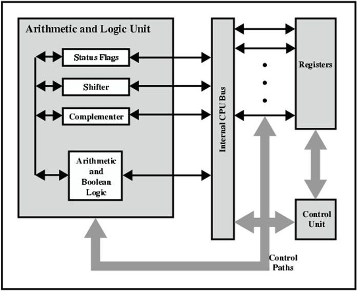
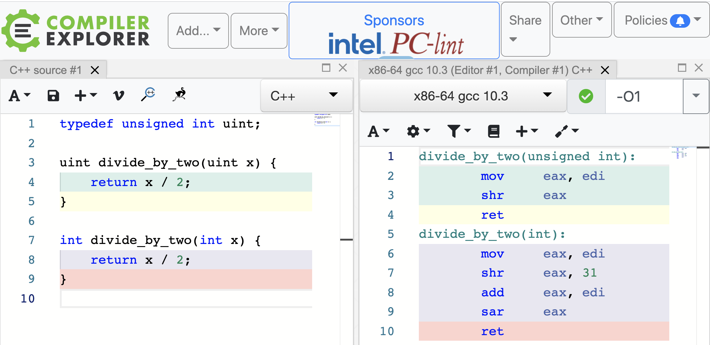
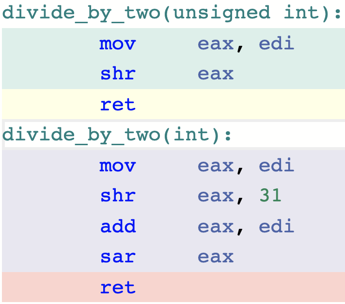
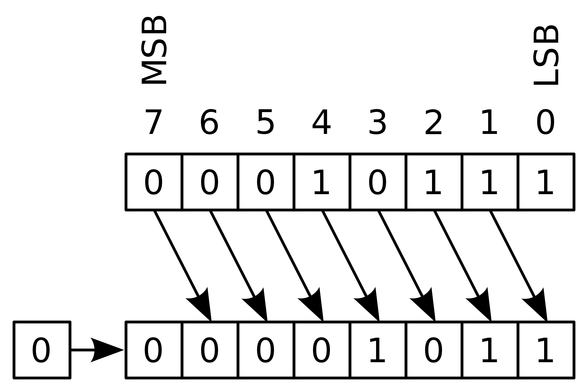
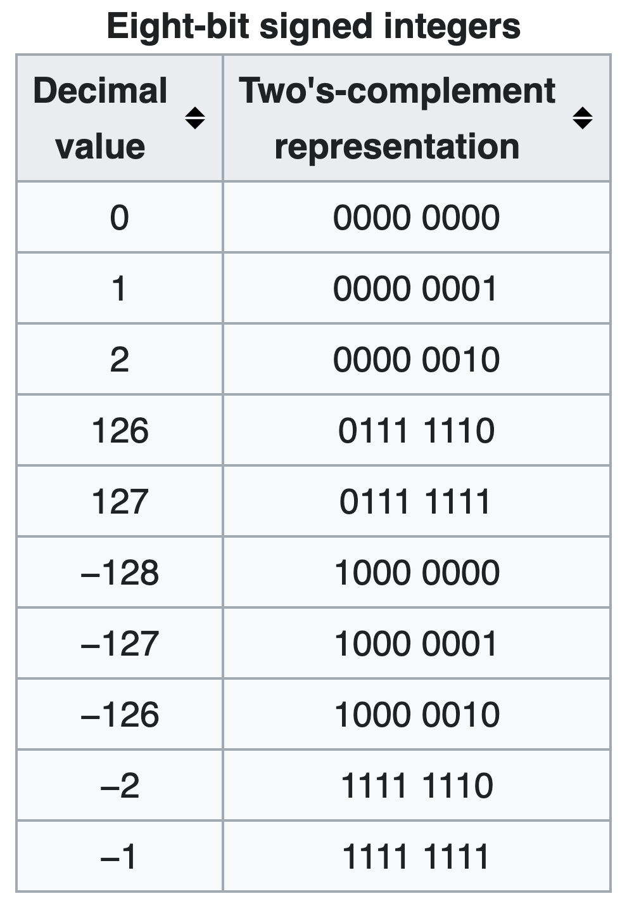
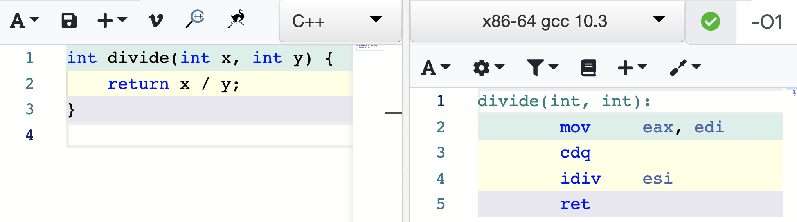
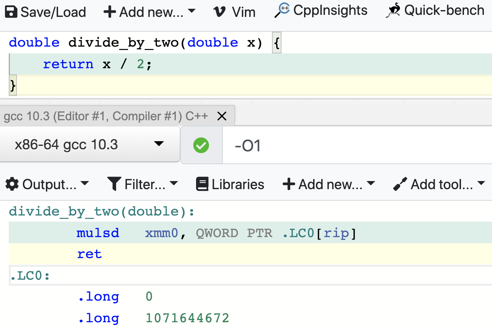

```{r setup, include = FALSE}
source(file.path("..", "R", "util.R"))

required_packages <- c('Rcpp', 'RcppEigen', 'RcppArmadillo', 'microbenchmark')
install_and_load_packages(required_packages)
```

```{r, include=FALSE}
# Cache Rcpp compilations
knitr::opts_chunk$set(cache = TRUE)

# Temporarily supress warnings because compilations generate a lot of them
default_warn_opt <- getOption("warn") 
options(warn = -1) 

# Print outputs without "##"
knitr::opts_chunk$set(comment = '')
```

# Word of wisdom on optimization

<p style="margin-top:12ex; font-size:26pt; font-family:garamond; font-style:italic;", class="center">
"Premature optimization is the root of all evil."
</p>

<p style="margin-top:1ex; font-size:25pt; font-family:'Times New Roman';", class="right"> &mdash; Donald Knuth </p>

---

# Word of wisdom on optimization

<blockquote>
<p style="margin-top:10ex; font-size:24pt; font-family:garamond; font-style:italic;">
We should forget about small efficiencies, say about 97% of the time: premature optimization is the root of all evil. Yet we should not pass up our opportunities in that critical 3%.
</p>
</blockquote>

<p style="margin-top:1ex; font-size:25pt; font-family:'Times New Roman';", class="right"> &mdash; Donald Knuth </p>

---

# Word of wisdom on optimization

<blockquote>
<p style="font-size:24pt; font-family:garamond; font-style:italic;">
Programmers waste enormous amounts of time thinking about, or worrying about, the speed of noncritical parts of their programs, and these attempts at efficiency actually have a strong negative impact when debugging and maintenance are considered. 
</p>
<p style="margin-top:-.5ex; font-size:24pt; font-family:garamond; font-style:italic;">
We should forget about small efficiencies, say about 97% of the time: premature optimization is the root of all evil. Yet we should not pass up our opportunities in that critical 3%.
</p>
</blockquote>

<p style="margin-top:-.5ex; font-size:25pt; font-family:'Times New Roman';", class="right"> &mdash; Donald Knuth </p>

---

# Word of wisdom on code readability

<p style="margin-top:11.5ex; font-size:24pt; font-family:garamond; font-style:italic;", class="center">
"Programs are meant to be read by humans and<br> only incidentally for computers to execute."
</p>
<p style="margin-top:1ex; font-size:25pt; font-family:'Times New Roman';", class="right"> &mdash; Donald Knuth </p>

---
class: center, middle, inverse

# Same functionality, varying performance

## (I mean, duh. But&hellip; umm, why?)

---

# "Vectorize!" but what does it mean, really?

e.g. `axpy` from _Basic Linear Algebra Subprograms_ (BLAS):
$$\bm{y} \gets a \bm{x} + \bm{y}$$

```{r}
axpy <- function(a, x, y) {
  for (i in 1:length(x)) {
    y[i] <- a * x[i] + y[i] 
  }
  return(y)
}

axpy_vec <- function(a, x, y) {
  y <- a * x + y
  return(y)
}
```

---

# "Vectorize!" but what does it mean, really?

```{r}
n <- 10^6
a <- 3.14
x <- rep(1, n)
y <- rep(0.00159, n)
```

--

```{r, comment=''}
bench::mark(axpy(a, x, y))
bench::mark(axpy_vec(a, x, y))
```

---

# "Compiled code is faster" but why?

```{r}
sourceCpp(file.path('src', 'axpy_c.cpp'))
```
<p style="margin-top: -.5ex;"> </p>

```{r, comment='', echo=FALSE}
cat(readLines(file.path('src', 'axpy_c.cpp')), sep = '\n')
```

--

```{r, comment=''}
bench::mark(axpy_c(a, x, y))
```

---

# "Compiled code is faster" but why?

```{r, eval=FALSE}
sourceCpp(file.path('src', 'axpy_c.cpp'))
```
<p style="margin-top: -.5ex;"> </p>

```{r, comment='', echo=FALSE}
cat(readLines(file.path('src', 'axpy_c.cpp')), sep = '\n')
```

<p style="margin-top: -.5ex;"> </p>

**Note:** This function directly modifies `y`.
<p style="margin-top: -1ex;"> </p>
```{r}
y <- rep(0.00159, n)
invisible(axpy_c(a, x, y))
head(y)
```

---

# Is a dedicated linear algebra library faster?

```{r}
sourceCpp(file.path('src', 'axpy_eigen.cpp'))
```

```{r, comment='', echo=FALSE}
cat(readLines(file.path('src', 'axpy_eigen.cpp')), sep = '\n')
```

--

```{r}
bench::mark(axpy_eigen(a, x, y))
```

---

# Is a dedicated linear algebra library faster?

```{r}
sourceCpp(file.path('src', 'axpy_arma.cpp'))
```

```{r, comment='', echo=FALSE}
cat(readLines(file.path('src', 'axpy_arma.cpp')), sep = '\n')
```

```{r}
bench::mark(axpy_arma(a, x, y))
```

---
layout: true

# Details matter in "tight loops"

---

Consider two implementations of a `sign` function:
```{r, message=FALSE}
sourceCpp(file.path('src', 'sign.cpp'))
```

```{r, comment='', echo=FALSE}
cat(readLines(file.path('src', 'sign.cpp'))[5:20], sep = '\n')
```

---

Consider two implementations of a `sign` function:
```{r, eval=FALSE}
sourceCpp(file.path('src', 'sign.cpp'))
```

```{r, comment='', echo=FALSE}
cat(readLines(file.path('src', 'sign.cpp'))[22:30], sep = '\n')
```

---

Let's compare their performances:
```{r}
x <- rnorm(10^6)
bench::mark(sign_via_if(x))
bench::mark(sign_via_diff(x))
```

---

Let's try again to make sure... oh, what happened?
```{r}
x <- rep(1, 10^6)
bench::mark(sign_via_if(x))
bench::mark(sign_via_diff(x))
```

```{r, include=FALSE}
# No more Rcpp compilations; stop caching
knitr::opts_chunk$set(cache = FALSE)

# Turn back on warnings
options(warn = default_warn_opt)
```

---
layout: false
class: center, middle, inverse

# A bit of assembly code

---

# Quick peek into CPU


---

# What's machine doing behind the scene?

To foster mutual understanding between us and machine, let's look at simple _assembly code_.

--



---

# Registers: most accessible data storage


---

<!-- Let's now try to decifer what our machine friend is doing: -->
# Division via bit-shift
.pull-left[
   
]
--
.pull-right[
  "shr" = _logical shift_ to right
  
]

---

# Division via bit-shift
.pull-left[
   
]
--
.pull-right[
  
]
<!-- https://stackoverflow.com/questions/40638335/why-does-the-compiler-generate-a-right-shift-by-31-bits-when-dividing-by-2 -->

---

# More general divisions

In order to optimize division as bit-shift, a compiler needs to know we are dividing by 2 and not by a generic integer:

 

---

# More general divisions

Floating point arithmetic uses completely different logic:

 

