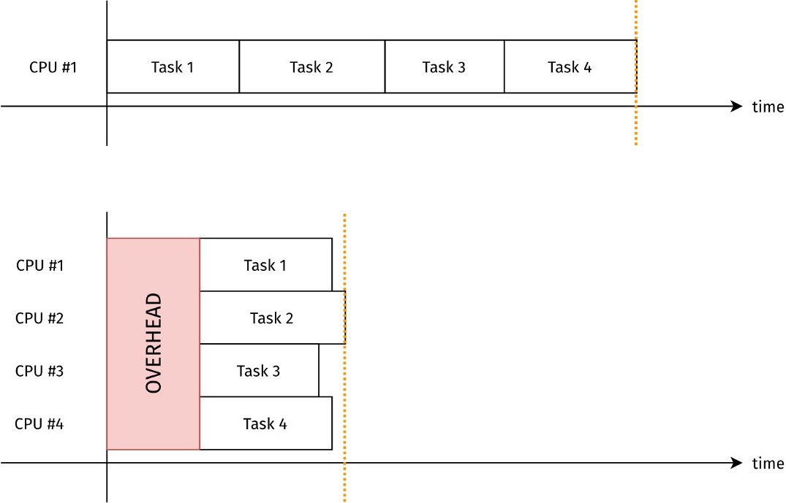

```{r setup, include = FALSE}
source(file.path("..", "R", "util.R"))

required_packages <- c('Rcpp', 'RcppEigen', 'RcppArmadillo', 'microbenchmark')
install_and_load_packages(required_packages)
```

```{r, include=FALSE}
# Cache Rcpp compilations
knitr::opts_chunk$set(cache = TRUE)

# Temporarily supress warnings because compilations generate a lot of them
default_warn_opt <- getOption("warn") 
options(warn = -1) 

# Print outputs without "##"
knitr::opts_chunk$set(comment = '')
```

# Word of wisdom on optimization

<p style="margin-top:12ex; font-size:26pt; font-family:garamond; font-style:italic;", class="center">
"Premature optimization is the root of all evil."
</p>

<p style="margin-top:1ex; font-size:25pt; font-family:'Times New Roman';", class="right"> &mdash; Donald Knuth </p>

---

# Word of wisdom on optimization

<blockquote>
<p style="margin-top:10ex; font-size:24pt; font-family:garamond; font-style:italic;">
We should forget about small efficiencies, say about 97% of the time: premature optimization is the root of all evil. Yet we should not pass up our opportunities in that critical 3%.
</p>
</blockquote>

<p style="margin-top:1ex; font-size:25pt; font-family:'Times New Roman';", class="right"> &mdash; Donald Knuth </p>

---

# Word of wisdom on optimization

<blockquote>
<p style="font-size:24pt; font-family:garamond; font-style:italic;">
Programmers waste enormous amounts of time thinking about, or worrying about, the speed of noncritical parts of their programs, and these attempts at efficiency actually have a strong negative impact when debugging and maintenance are considered. 
</p>
<p style="margin-top:-.5ex; font-size:24pt; font-family:garamond; font-style:italic;">
We should forget about small efficiencies, say about 97% of the time: premature optimization is the root of all evil. Yet we should not pass up our opportunities in that critical 3%.
</p>
</blockquote>

<p style="margin-top:-.5ex; font-size:25pt; font-family:'Times New Roman';", class="right"> &mdash; Donald Knuth </p>

---

# Word of wisdom on code readability

<p style="margin-top:11.5ex; font-size:24pt; font-family:garamond; font-style:italic;", class="center">
"Programs are meant to be read by humans and<br> only incidentally for computers to execute."
</p>
<p style="margin-top:1ex; font-size:25pt; font-family:'Times New Roman';", class="right"> &mdash; Donald Knuth </p>

---
class: center, middle, inverse

# Same functionality, varying performance

## (I mean, duh. But&hellip; umm, why?)

---

# "Vectorize!" but what does it mean, really?

e.g. `axpy` from _Basic Linear Algebra Subprograms_ (BLAS):
$$\bm{y} \gets a \bm{x} + \bm{y}$$

--

```{r}
axpy <- function(a, x, y) {
  for (i in 1:length(x)) {
    y[i] <- a * x[i] + y[i] 
  }
  return(y)
}

axpy_vec <- function(a, x, y) {
  y <- a * x + y
  return(y)
}
```

---

# "Vectorize!" but what does it mean, really?

```{r}
n <- 10^6
a <- 3.14
x <- rep(1, n)
y <- rep(0.00159, n)
```

--

```{r, eval=FALSE}
bench::mark(axpy(a, x, y))
```

```{r, echo=FALSE}
summarize_benchmark(
  bench::mark(axpy(a, x, y))
)
```

```{r, eval=FALSE}
bench::mark(axpy_vec(a, x, y))
```

```{r, echo=FALSE}
summarize_benchmark(
  bench::mark(axpy_vec(a, x, y))
)
```

---

# "Compiled code is faster" but why?

```{r}
sourceCpp(file.path('src', 'axpy_c.cpp'))
```
<p style="margin-top: -.5ex;"> </p>

```{r, comment='', echo=FALSE}
cat(readLines(file.path('src', 'axpy_c.cpp')), sep = '\n')
```

--

```{r, eval=FALSE}
bench::mark(axpy_c(a, x, y))
```

```{r, echo=FALSE}
summarize_benchmark(
  bench::mark(axpy_c(a, x, y))
)
```

---

# "Compiled code is faster" but why?

```{r, eval=FALSE}
sourceCpp(file.path('src', 'axpy_c.cpp'))
```
<p style="margin-top: -.5ex;"> </p>

```{r, comment='', echo=FALSE}
cat(readLines(file.path('src', 'axpy_c.cpp')), sep = '\n')
```

<p style="margin-top: -.5ex;"> </p>

**Note:** This function directly modifies `y`.
<p style="margin-top: -1ex;"> </p>
```{r}
y <- rep(0.00159, n)
invisible(axpy_c(a, x, y))
head(y)
```

---

# Is a dedicated linear algebra library faster?

```{r}
sourceCpp(file.path('src', 'axpy_eigen.cpp'))
```

```{r, comment='', echo=FALSE}
cat(readLines(file.path('src', 'axpy_eigen.cpp')), sep = '\n')
```

--

```{r, eval=FALSE}
bench::mark(axpy_eigen(a, x, y))
```

```{r, echo=FALSE}
summarize_benchmark(
  bench::mark(axpy_eigen(a, x, y))
)
```

---

# Is a dedicated linear algebra library faster?

```{r}
sourceCpp(file.path('src', 'axpy_arma.cpp'))
```

```{r, comment='', echo=FALSE}
cat(readLines(file.path('src', 'axpy_arma.cpp')), sep = '\n')
```

```{r, eval=FALSE}
bench::mark(axpy_arma(a, x, y))
```

```{r, echo=FALSE}
summarize_benchmark(
  bench::mark(axpy_arma(a, x, y))
)
```

```{r, include=FALSE}
# No more Rcpp compilations; stop caching
knitr::opts_chunk$set(cache = FALSE)

# Turn back on warnings
options(warn = default_warn_opt)
```

---
layout: false
class: center, middle, inverse

# A bit of assembly code

---

# Quick peek into CPU


---

# Registers: most accessible data storage


---

# What's machine doing behind the scene?

To foster mutual understanding between us and machine, let's look at simple _assembly code_.

--


---

<!-- Let's now try to decifer what our machine friend is doing: -->
# Division via bit-shift
.pull-left[
   
]
--
.pull-right[
  "shr" = _logical shift_ to right
  
  
]

---

# Division via bit-shift
.pull-left[
   
]
.pull-right[
  "sar" = _arith. shift_ to right
  
  
]
<!-- https://stackoverflow.com/questions/40638335/why-does-the-compiler-generate-a-right-shift-by-31-bits-when-dividing-by-2 -->

---

# Division via bit-shift
.pull-left[
   
]
.pull-right[
  
]

---

# More general divisions

In order to optimize division as bit-shift, a compiler needs to know we are dividing by 2 and not by a generic integer:

 

---

# More general divisions

Floating point arithmetic uses completely different logic:

 

---
layout: false
class: center, middle, inverse

# Pipelining "fetch-decode-execute-store"
## How to keep your CPU "executing"

---
layout: true

# Example: effect of details in "tight loops"

---

Consider two implementations of a `sign` function:
```{r, message=FALSE, cache=TRUE}
sourceCpp(file.path('src', 'sign.cpp'))
```

```{r, comment='', echo=FALSE}
cat(readLines(file.path('src', 'sign.cpp'))[5:20], sep = '\n')
```

---

Consider two implementations of a `sign` function:
```{r, eval=FALSE}
sourceCpp(file.path('src', 'sign.cpp'))
```

```{r, comment='', echo=FALSE}
cat(readLines(file.path('src', 'sign.cpp'))[22:30], sep = '\n')
```

---

Let's compare their performances:
```{r, echo=FALSE}
x <- rnorm(10^6)
```

```{r, eval=FALSE}
x <- rnorm(10^6)
bench::mark(sign_via_if(x))
```

```{r, echo=FALSE}
summarize_benchmark(
  bench::mark(sign_via_if(x))
)
```

```{r, eval=FALSE}
bench::mark(sign_via_diff(x))
```

```{r, echo=FALSE}
summarize_benchmark(
  bench::mark(sign_via_diff(x))
)
```

---

Another run just to make sure... oh, what happened?
```{r, echo=FALSE}
x <- rep(1, 10^6)
```

```{r, eval=FALSE}
x <- rep(1, 10^6)
bench::mark(sign_via_if(x))
```

```{r, echo=FALSE}
summarize_benchmark(
  bench::mark(sign_via_if(x))
)
```

```{r, eval=FALSE}
bench::mark(sign_via_diff(x))
```

```{r, echo=FALSE}
summarize_benchmark(
  bench::mark(sign_via_diff(x))
)
```

---
layout: false

# Instruction cycle:<br> $\quad$ fetch-decode-execute-store

 

---

# Instruction cycle:<br> $\quad$ fetch-decode-execute-store

 

---

# "Instruction pipelining" to avoid idle time

<p style="margin-top: -1ex;"> </p>
 

---
layout: true

# Keep it simple & predictable for pipelining

---

You can't pipeline if the next action depends on curr one!

---

Let's take another look at the two `sign` implementations:

 

---

Let's take another look at the two `sign` implementations:

 

---

Let's take another look at the two `sign` implementations:

 


---
layout: false
class: center, middle, inverse

# It's about time: <br> worry less about number of arithmetic ops & more about data motion efficiency

---

# CPU got communication issues with RAM <br> .small[(a.k.a. von Neumann bottleneck)]
<!-- <p style="margin-top: -1ex;"> </p> -->


---
layout: true

# Example: row- vs. column-oriented matvec

---

<!-- <p style="margin-top: 3ex;"> </p> -->
Matvec $\bm{x} \to \bm{A} \bm{x}$ viewed as multiplying rows of $\bm{A}$ with $\bm{x}$:

 

---

Viewed as adding up cols of $\bm{A}$ multiplied by entries of $\bm{x}$:

 

<p style="margin-top:-.5ex;"> </p>

--

.pull-left[
```{r, eval=FALSE}
# Row-oriented matvec
Ax <- rep(0, n_row)
for (i in 1:n_row) {
  for (j in 1:n_col) {
    Ax[i] <- Ax[i] + 
      A[i, j] * x[j]
  }
}
```
]

.pull-right[
```{r, eval=FALSE}
# Column-oriented matvec
Ax <- rep(0, n_row)
for (j in 1:n_col) {
  for (i in 1:n_row) {
    Ax[i] <- Ax[i] + 
      A[i, j] * x[j]
  }
}
```
]

---

Here is how a row-oriented matvec looks like:
```{r}
row_oriented_matvec <- function(A, v) {
  Av <- rep(0., n_row)
  for (i in 1:n_row) {
    Av[i] <- sum(A[i, ] * v)
  }
  return(Av)
}
```
and a column-oriented matvec:
```{r}
col_oriented_matvec <- function(A, v) {
  Av <- rep(0., n_row)
  for (j in 1:n_col) {
    Av <- Av + A[, j] * v[j]
  }
  return(Av)
}
```

---

Let's compare their performence:

```{r}
n_row <- 4096L
n_col <- 4096L
A <- matrix(rnorm(n_row * n_col), n_row, n_col)
v <- rnorm(n_row)
```

--

```{r, eval=FALSE}
bench::mark(
  row_oriented_matvec(A, v)
)
```

```{r, echo=FALSE}
bench_output <- bench::mark(
  Av_via_row <- row_oriented_matvec(A, v)
)
summarize_benchmark(bench_output)
```

```{r, eval=FALSE}
bench::mark(
  col_oriented_matvec(A, v)
)
```

```{r, echo=FALSE}
bench_output <- bench::mark(
  Av_via_col <- col_oriented_matvec(A, v)
)
summarize_benchmark(bench_output)
```

```{r, echo=FALSE}
stopifnot(are_all_close(Av_via_col, Av_via_row))
```

---

Huh, maybe because it's not compiled code? Let's check.

```{r, message=FALSE}
sourceCpp(file.path('src', 'matvec.cpp'))
```

```{r, comment='', echo=FALSE}
cat(readLines(file.path('src', 'matvec.cpp'))[6:21], sep = '\n')
```

---

Huh, maybe because it's not compiled code? Let's check.

```{r, message=FALSE}
sourceCpp(file.path('src', 'matvec.cpp'))
```

```{r, comment='', echo=FALSE}
cat(readLines(file.path('src', 'matvec.cpp'))[24:39], sep = '\n')
```

---

Huh, maybe because it's not compiled code? Let's check.

```{r, eval=FALSE}
bench::mark(
  row_oriented_matvec_c(A, v)
)
```

```{r, echo=FALSE}
bench_output <- bench::mark(
  Av_via_row <- row_oriented_matvec_c(A, v)
)
summarize_benchmark(bench_output)
```

```{r, eval=FALSE}
bench::mark(
  col_oriented_matvec_c(A, v)
)
```

```{r, echo=FALSE}
bench_output <- bench::mark(
  Av_via_col <- col_oriented_matvec_c(A, v)
)
summarize_benchmark(bench_output)
```

--

```{r, eval=FALSE}
bench::mark(A %*% v)
```

```{r, echo=FALSE}
summarize_benchmark(bench::mark(A %*% v))
```

---
layout: false

# Challenge: feeding data fast enough to CPU


---

# Effect of cache miss and memory latency

Consider the following situation in your computer:
* CPU keeps itself busy if all data were in L1 cache,
but need 10 clock cycles to fetch data from L2 cache.
--

* On average, CPU finds 90% of necessary data in L1 cache, but have to look L2 cache for remaining 10%.

--

How long does it take for CPU to complete 10&nbsp;operations?
<!-- "how long" = "how many clock cycles" -->

---

# Lesson: optimize your code for data motion

Turns out R arrays are stored in _column major_ order:

<p style="margin-top: 3ex; margin-bottom: 3ex;"> 

</p>

--

So it is more efficient to access its elements column-wise!

---

# Lesson: optimize your code for data motion

In C and Python, arrays are stored in _row major_ order:

<p style="margin-top: 3ex; margin-bottom: 3ex;"> 

</p>

Make sure you choose the right order for double for-loops!
(Stan uses C arrays, for example.)

---

# Things get even more complicated when trying to parallelize over multiple CPUs

<p style="margin-top: 3ex;"> </p>


---

<p style="margin-top: 3ex;"> </p>


---

<p style="margin-top: 4ex;"> </p>

.large[**Nov 2020 Ranking:**]<br> 
$\quad$ .large[**Actual over theoretical performance**]


---
class: center, middle, inverse

# Different flavors of parallel computing

---

# Parallelization: no-brainer in theory, but...


---

# Parallelization: no-brainer in theory, but...



---

# Types of parallelization opportunities

### Inherently independent tasks
<p style="opacity:0"> 
* Bootstrap and cross-validation
* Regression with multiple outcomes
</p>

### Serial task with parallelizable components
<p style="opacity:0"> 
* Maximizing likelihood via (stochastic) gradient descent
* Markov chain Monte Carlo with lots of linear algebra
</p>

---

# Types of parallelization opportunities

### Inherently independent tasks
* Bootstrap and cross-validation
* Regression with multiple outcomes

### Serial task with parallelizable components
* Maximizing likelihood via (stochastic) gradient descent
* Markov chain Monte Carlo with lots of linear algebra

--

**Note:** <p style="margin-top: -.5ex;">  </p>
* Many problems are hybrids of the two kinds.
* Even seemingly indepenent tasks may be done more efficiently together or with shared resources.

---

# Types of parallelization opportunities

### Inherently independent tasks ("coarse-scale" parallelization)
* Bootstrap and cross-validation
* Regression with multiple outcomes

### Serial task with parallelizable components ("fine-scale")
* Maximizing likelihood via (stochastic) gradient descent
* Markov chain Monte Carlo with lots of linear algebra

**Note:** <p style="margin-top: -.5ex;">  </p>
* Many problems are hybrids of the two kinds.
* Even seemingly indepenent tasks may be done more efficiently together or with shared resources.

---

# Multi-threading vs -processing


**Rule of thumb:** For typical stat computing problems,
* multi-threading necessary for "fine" parallel tasks.
* multi-processing good enough for "coarse" ones. 

---

# Threads share resources, processes don't


Processes &mdash; more expensive to set up ( $=$ _more overhead_ )

Threads &mdash; "lightweight processes," sharing memory and capable of exchanging (but also of corrupting) data

---

# What's involved in multi-processing set-up

<p style="margin-top: 3ex;"> </p>

<p style="margin-top: 2ex;"> </p>
<!-- https://www.blasbenito.com/post/02_parallelizing_loops_with_r/ -->

When you call&thinsp; `foreach(...) %dopar% {...}`, new R instances are launched and all the variables are copied.

---

# What's involved in multi-processing set-up

<p style="margin-top: 3ex;"> </p>

<p style="margin-top: 2ex;"> </p>

Actually, there are multiple backends for multi-processing, w/ `fork` (Unix only) and `socket` available in R `parallel`.

---

# Major bummer warning: no multi-threading in (pure) R or Python!

R/Python interpreters dot **not** deal with mulitple threads, so interfacing with C/C++/Fortran is the only way around.

---

# Major bummer warning: no multi-threading in (pure) R or Python!

That said, there still are (relatively) easy, indirect accesses to multi-threading you can exploit when using R/Python:

* Packages you use might be multi-threaded via C/C++.<br>
  * Watch for options to specify the number of cores, e.g. `stan(..., cores = 4)`.
  * But set `logical = FALSE`&thinsp; in `detectCores()`!

--
* If you built R/Python with an optimized BLAS library, then many linear algebra ops are multi-threaded.

--
* For some packages (e.g. `RcppEigen`), you only need to specify right compiler flags in `Makevars(.win)` file. 

---

# Word of caution: don't get fooled by "threading" module in Python


---
class: middle, center, inverse

# Summary & References

## Hardware aware computing

---

# Summary: optimize, but only as warranted

<blockquote>
<p style="margin-top:10ex; font-size:24pt; font-family:garamond; font-style:italic;">
Rules of Optimization:<br>
Rule 1: Don't do it.<br>
Rule 2 (for experts only): Don't do it yet.
</p>
</blockquote>

<p style="margin-top:1ex; font-size:25pt; font-family:'Times New Roman';", class="right"> &mdash; Michael A. Jackson </p>

---

# Summary: effects of hardware design

We looked at inner workings of computer to ...
* Build intuition on why some code runs faster
  * How variable type info is used
  * When instructions can be pipelined
  * Et cetera, et cetera, et cetera, ...
--

* Appreciate its complexity:
  * Simplified picture is valuable but has its limits
  * Be systematic in identifying perf. bottleneck

---

# Summary: effects of hardware design

Data motaion $\ge$ arithmetic op counts
* Cache miss and latency have massive impacts on computational speed.
* Work with data that are near-by in memory for efficient data access (and hence efficient computation).

--

Parallelization
* Mind the overheads
* Fine-scale one requires more thoughts/work

---

# References: hardware and computing
.pull-left[
  
  ![:vspace -1ex]
]


![:vspace -.5ex]


![:vspace 3ex]


---

# References: R and Python how-to

###R and Rcpp

_Advanced R_:&thinsp; Rewriting R code in C++ <br>
$\quad$ https://adv-r.hadley.nz/rcpp.html#rcpp

_R Packages_:&thinsp; Compiled code &mdash; https://r-pkgs.org/src.html

--

Rcpp page: http://dirk.eddelbuettel.com/code/rcpp.html

Rcpp Gallery: https://gallery.rcpp.org/

--

### Python

_High Performance Python: <br> $\quad$ Practical Performant Programming for Humans_

---

# References: CPU/GPU parallelization

![:vspace 3ex]
"Understanding GPU programming for statistical computation: Studies in massively parallel massive mixtures." Suchard et. al. (2010).
<br> $\quad$ https://doi.org/10.1198/jcgs.2010.10016

![:vspace 3ex]
"Vector operations for accelerating expensive Bayesian computations &mdash; a tutorial guide."&thinsp; Warne et. al. (2021).<br> 
$\quad$ https://doi.org/10.1214/21-BA1265

