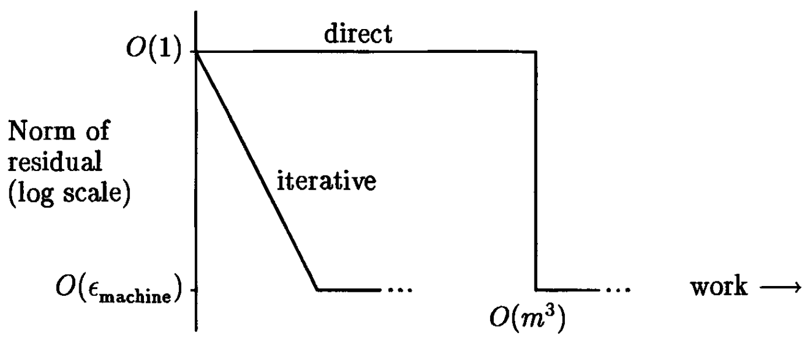
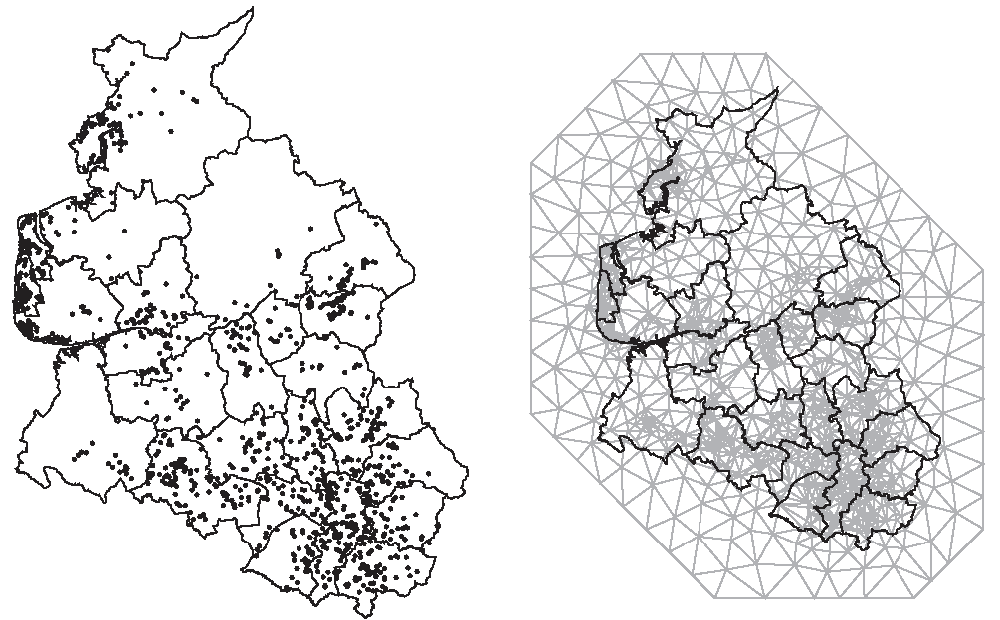
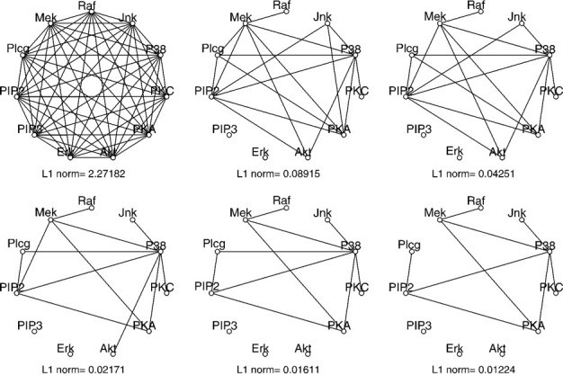
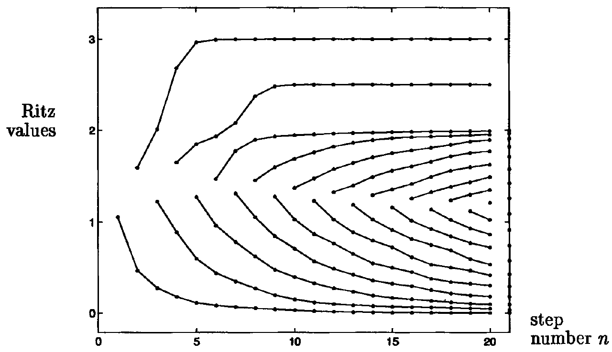
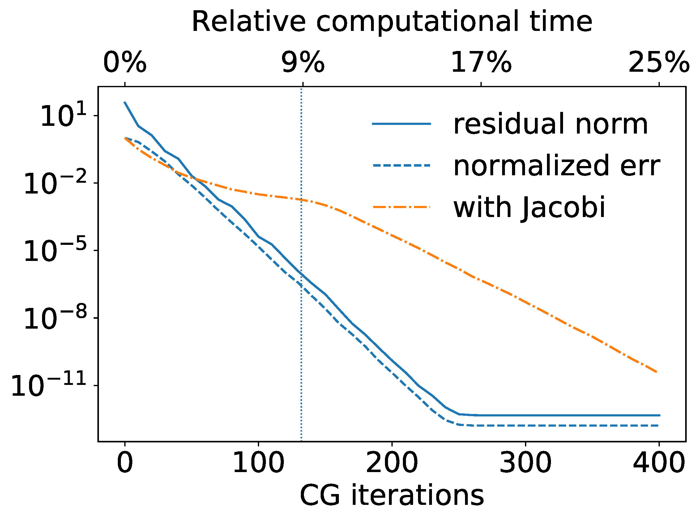
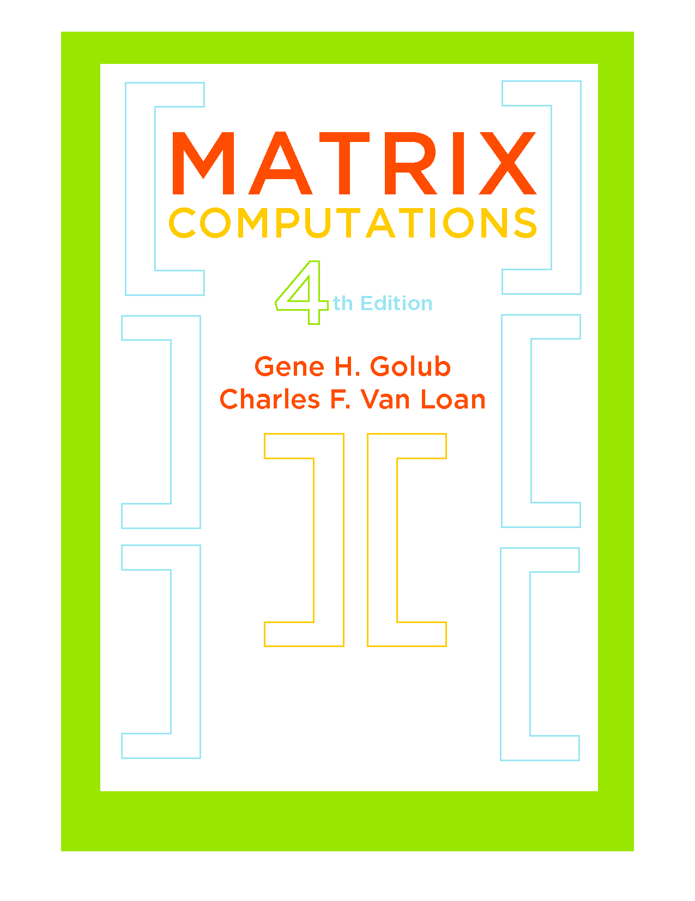
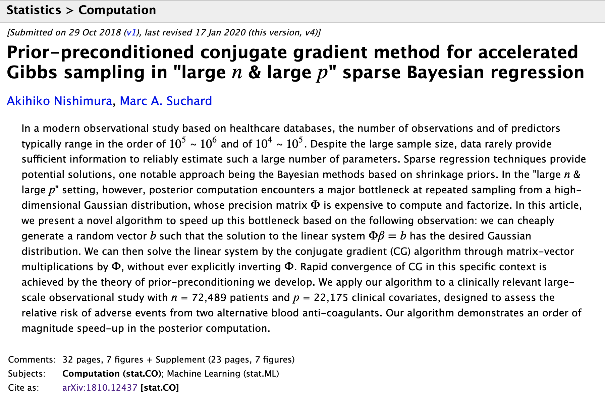

```{r setup, include = FALSE}
required_packages <- c('Matrix', 'testit')
for (pkg in required_packages) {
  if (!(pkg %in% rownames(installed.packages()))) {
    install.packages(pkg)
  }
  library(pkg, character.only = TRUE)
}
source(file.path("..", "R", "util.R"))
```

# What are iterative methods?

Direct v.s. iterative solutions:



---

# Iterative methods: broad definition

Examples of direct methods: 
* Solving a quadratic, or quartic, equation
* Least-squre via QR decomposition

--

Examples of iterative methods (under broad definition):
* Minimizing a function via Newton's method
* Full eigenvalue decomposition $\bm{A} = \bm{U} \bm{\Lambda} \bm{U}^\intercal$

---

# Iterative methods: narrow definition

In numerical linalg, "iterative methods" often refer to algorithms that rely solely on the operation $\bm{v} \to \bm{A} \bm{v}$.

--

<p style="margin-top:2.5ex;"> </p>
For example, many iterative methods for
* solving $\bm{A} \bx = \bm{b}$
* finding largest and smallest eigenvalues/vectors of $\bm{A}$
* minimizing $\| \bm{A} \bx - \bm{b} \|^2$ (or $\| \bm{X} \bm{\beta} - \bm{y} \|^2$)

<p style="margin-top:-1ex;"> </p>
only require operations of the form $\bm{v} \to \bm{A} \bm{v}$. 

--

<p style="margin-top:2.5ex;"> </p>
These algorithms are _agnostic_ to how computer represents $\bm{A}$ and calculates $\bm{v} \to \bm{A} \bm{v}$.

---

# What's the big deal w/ iterative methods?

## Wrong-but-useful argument in terms algorithmic complexity:
* Most direct methods have $O(\min\{n p^2, n^2 p\})$ costs.
* Iterative methods require $k$ matrix-vector multi-plication $\bm{v} \to \bm{A} \bm{v}$ where $k \ll \min\{n, p\}$ potentially.

---

# What's the big deal w/ iterative methods?

## Better arguments
In many modern applications, the matrix of interest $\bm{A}$
* has special structure for fast $\bm{v} \to \bm{A} \bm{v}$ operations.
* is so big that storing it explicitly &mdash; as required for direct methods &mdash; is impossible.

--

For example, $\bm{A}$ may corresond to
* design matrix for sparse binary features
* sparse precision/inverse-covariance matrix
--

* matrix with underlying graph/tree structure
* wavelet transform for decomposing singnals

---
layout: true

# When you might want iterative methods

## Example: centered (and standardized) sparse binary design

---

```{r}
n_obs <- 10^4
n_pred <- 10^3
X <- simulate_sparse_binary_design(
  n_obs, n_pred, density = .01, seed = 140850
)
```

--

Sparse matrix $\bm{X}$ won't be sparse after $\bm{X} \gets \bm{X} - \bm{1} \cdot \bm{\bar{x}}^\intercal$.

Nor binary matrix $\bm{X}$ binary after $\bm{X} \gets \bm{X} \cdot \textrm{diag}(\bm{\sigma}_{\bm{X}}^{-1})$.

--

Bye-bye memory efficiency: 

.center[1% dense -> 100% dense &nbsp;&nbsp; & &nbsp;&nbsp; 1 bit -> 64 bits]

Beg for a fancy computer, or go home and cry.

---

But wait! You can multiply by a centered and standardized matrix _without_ ever centering or standarding explicitly:

$$\textrm{diag}(\bm{\sigma}_{\bm{X}}^{-1}) \cdot \bm{v} = \bm{v} / \bm{\sigma}_{\bm{X}}$$
$$\left(\bm{X} - \bm{1} \cdot \bm{\bar{x}}^\intercal \right) \bm{v} = \bm{X} \bm{v} - (\bm{\bar{x}}^\intercal \bm{v}) \bm{1}$$

---

```{r, eval=FALSE, echo=FALSE}
pred_mean <- colMeans(X)
pred_mean_smoothed <- (.5 + colSums(X)) / (1 + n_obs) # Continuity correction
pred_var <- pred_mean_smoothed * (1 - pred_mean_smoothed)
pred_sd <- sqrt(pred_var)
```

```{r}
pred_mean <- colMeans(X)
pred_var <- pred_mean * (1 - pred_mean)
pred_sd <- sqrt(pred_var)

standardized_matvec <- function(X, v) {
  v <- v / pred_sd
  result <- X %*% v
  result <- result - sum(pred_mean * v)
  return(as.vector(result))
}
```

---

```{r}
v <- rnorm(n_pred)
efficient_matvec_output <- standardized_matvec(X, v)

X_dense <- as.matrix(X)
for (j in 1:n_pred) {
  X_dense[, j] <- (X_dense[, j] - pred_mean[j]) / pred_sd[j]
}
brute_matvec_output <- as.vector(X_dense %*% v)

```

--

```{r}
assert("Two outputs agree",
  are_all_close(
    efficient_matvec_output, 
    brute_matvec_output, 
    rel_tol = 1e-3
  )
)
```


---
layout: false

# When you might want iterative methods

## Example: graphical model / Gaussian Markov random fields 

**Fact:** If $\bx \sim \normalDist(\bm{\mu}, \bm{\Phi}^{-1})$, then 
$\Phi_{ij} = 0 \ \Leftrightarrow \ x_i \indep x_j \given \bx_{-ij}.$

--



---

# When you might want iterative methods

## Example: graphical model / Gaussian Markov random fields 

**Fact:** If $\bx \sim \normalDist(\bm{\mu}, \bm{\Phi}^{-1})$, then 
$\Phi_{ij} = 0 \ \Leftrightarrow \ x_i \indep x_j \given \bx_{-ij}.$



---

# Power iteration for largest eigenvec/val

### ( $\in$ Broad-sense iterative methods)

--

Albeit unnecessary, let's assume $\bm{A}$ symmetric so that
$$\bm{A} = \bm{U} \bm{\Lambda} \bm{U}^\intercal = \sum_i \lambda_i \bm{u}_i \bm{u}_i^\intercal \ \text{ for } \ \lambda_1 \geq \lambda_2 \geq \ldots.$$

--

This means that
$$\bm{A}^k = \bm{U} \bm{\Lambda}^k \bm{U}^\intercal = \sum_i \lambda_i^k \bm{u}_i \bm{u}_i^\intercal.$$

--

If $\lambda_1 > \lambda_2$, eventually $\lambda_1^k \gg \lambda_2^k$ and $\bm{A}^k \approx \lambda_1^k \bm{u}_1 \bm{u}_1$.

---

# Power iteration for largest eigenvec/val

You'd be nuts to compute $\bm{A}^k$.

---
layout: true

# Power iteration for largest eigenvec/val

You'd be nuts to compute $\bm{A}^k$, _but_ can iterate $\bm{v} \to \bm{A} \bm{v}$!

---

```{r, eval=FALSE}
power_iterate <- function (A, init_vec, n_iter) {
  v <- init_vec
  for (k in 1:n_iter) {
    v <- A %*% v
    v <- v / sqrt(sum(v^2)) # $\lambda_1^k$ might ex/inplode o.w.
  }
  ...
}
```

--

This gives us $\bm{v} \approx \bm{u}_1$. Now, how do we approximate $\lambda_1$?

--

Use _Rayleigh-Ritz method_ &mdash; $\, \lambda_1 \approx \bm{v}^\intercal \bm{A} \bm{v} \,$ because
$$\bm{u}_1^\intercal \bm{A} \bm{u}_1 = \bm{u}_1^\intercal \left( \sum_i \lambda_i \bm{u}_i \bm{u}_i^\intercal \right) \bm{u}_1 = \lambda_1.$$

---

```{r, eval=FALSE}
power_iterate <- function (A, init_vec, n_iter) {
  v <- init_vec
  for (k in 1:n_iter) {
    v <- A %*% v
    v <- v / sqrt(sum(v^2)) # $\lambda_1^k$ might ex/inplode o.w.
  }
  ...
}
```

More generally, we have
$$\lambda_\max = \max_{\|\bm{v}\| = 1} \bm{v}^\intercal \bm{A} \bm{v} \ \, \text{ and } \ \,
\lambda_\min = \min_{\|\bm{v}\| = 1} \bm{v}^\intercal \bm{A} \bm{v}.$$

---

```{r, eval=FALSE}
power_iterate <- function (A, init_vec, n_iter) {
  v <- init_vec
  for (k in 1:n_iter) {
    v <- A %*% v
    v <- v / sqrt(sum(v^2)) # $\lambda_1^k$ might ex/inplode o.w.
  }
  eigvec_est <- v
  eigval_est <- t(eigvec_est) %*% A %*% eigvec_est
  return(list(eigvec_est, eigval_est))
}
```

--

**Fun fact:** Google's PageRank uses the power iteration. <br> (For a non-symmetric stochastic matrix $\bm{A}$.)

---
layout: false
class: center, middle, inverse

# Krylov subspace: "the" iterative methods

---

# Krylov subspace methods 

One lesson from power iteration:<br> 

.center[
  $\bm{A}^k \bm{v}$ tells you a lot about the largest eigenvec/val.
]

<p style="margin-top:3ex;"> </p>

--

Here is a more striking fact:
.center[
  the collection $\{ \bm{v}, \bm{A} \bm{v}, \bm{A}^2 \bm{v}, \ldots, \bm{A}^k \bm{v} \}$ tells you a lot about the extreme (largest and smallest) eigenvec/vals.
]

<p style="margin-top:3ex;"> </p>

--

The space 
$$\mathcal{K}_{k + 1}(\bm{A}, \bm{v}) = \textrm{span}\{\bm{v}, \bm{A} \bm{v}, \bm{A}^2 \bm{v}, \ldots, \bm{A}^k \bm{v} \}$$
is called the _Krylov subspace_.

---

# Taste of Krylov methods: Lanczos algo

Each iteration of a Krylov method requires one $\bm{v} \to \bm{A} \bm{v}$.

---

# Taste of Krylov methods: Lanczos algo

At the $k$-th iteration, _Lanczos algorithm_ outputs 
$$\bm{q}_1, \ldots \bm{q}_{k+1} \ \text{ and } \ \nu_1 \geq \ldots \geq \nu_{k+1},$$
extremes of which resembles extreme eigenvec/vals of $\bm{A}$.

--



---

# Taste of Krylov methods: Lanczos algo

To deploy it, just need to supply a recipe for $\bm{v} \to \bm{A} \bm{v}$:

```{python, eval=FALSE}
from scipy.sparse.linalg import eigsh

def multiply_by_A(v):
  ...
  return Av

A = LinearOperator((n_row, n_col), matvec=multiply_by_A)
eigenval, eigenvec = eigsh(A, k=10, which='BE')
  # Find eigenvec/val from "both ends": 5 largests & 5 smallests
  # Note: the number of required iterations is > k
```

**Note:**<br> $\mathcal{K}_{k + 1}(\bm{A}, \bm{v}) = \textrm{span}\{\bm{v}, \bm{A} \bm{v}, \ldots, \bm{A}^k \bm{v} \}$ does **not** depend as much on $\bm{v}$ as on $\bm{A}$. Think $\ \mathcal{K}_{k + 1}(\bm{A}, \bm{v}) \approx \mathcal{K}_{k + 1}(\bm{A})$.

---

# Taste of Krylov methods: Lanczos algo

When might you apply Lanczos algorithm?
* Find the largest eigenvalue of Fisher info $\bm{X}^\intercal \bm{W} \bm{X}$ for large-scale Bayesian sparse generalized linear model<br> .right[(Nishimura, Schuemie, and Suchard, 2021+)]

* Find the smallest eigenvalue of $\bm{\Sigma}^{-1}$ from multivariate phylogenetic probit model $\quad \qquad$ (Zhang et al., 2021+)

--

* Fast PCA from sparse $\bm{\Sigma}^{-1}$ graphical model?

---

# Other Krylov methods

Symmetric cases $\bm{A} = \bm{A}^\intercal$:
* _Lancozs iteration_ finds extreme eigenvector/values.
* _Conjugate gradient method_ solves $\bm{A} \bm{x} = \bm{b}$.

--

Non-symmetric cases:
* _Arnoldi iteration_ finds extreme eigenvector/values.
* _Generalized minimal residual method_ solves $\bm{A} \bm{x} = \bm{b}$.
* _LSQR_ finds minimizer of $\| \bm{A} \bm{x} - \bm{b} \|^2$ (or $\| \bm{X} \bm{\beta} - \bm{y} \|^2$).

--

**Note:** 
* You often gotta use them "right" for good performance.
* Smallest eigenvec/vals are trikier under finite prec.

---

# Other Krylov methods



<p style="margin-top: -1ex;"> </p>
CG speeding up Bayesian sparse logistic regression on blood anti-coagulant data with $n = 72{,}489$ & $p = 22{,}175$.<br> .right[(Nishimura and Suchard, 2018)]

---
class: inverse, middle, center

# Summary & References 

## Brief tour of iterative methods

---

# Summary
* Iterative method _do not_ require explicit storage of $\bm{A}$. Only a recipe for $\bm{v} \to \bm{A} \bm{v}$ is needed.
--

* Design algorithm/software with relevant data structures in mind. e.g. When appropriate,
  - support sparse design matrix.
  - accept `function(v){...}` as input.
--

* Choose a representation of data with algorithm performance in mind.

---

# References

 
<!-- Can't specify relative height --- I guess that the parent's height is undefined? -->

---

# References


