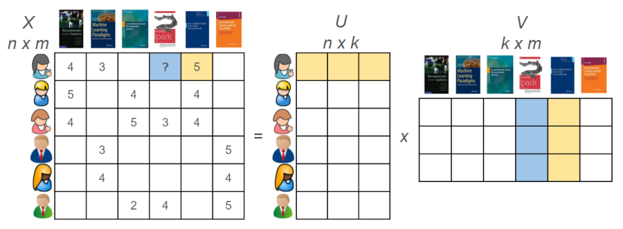
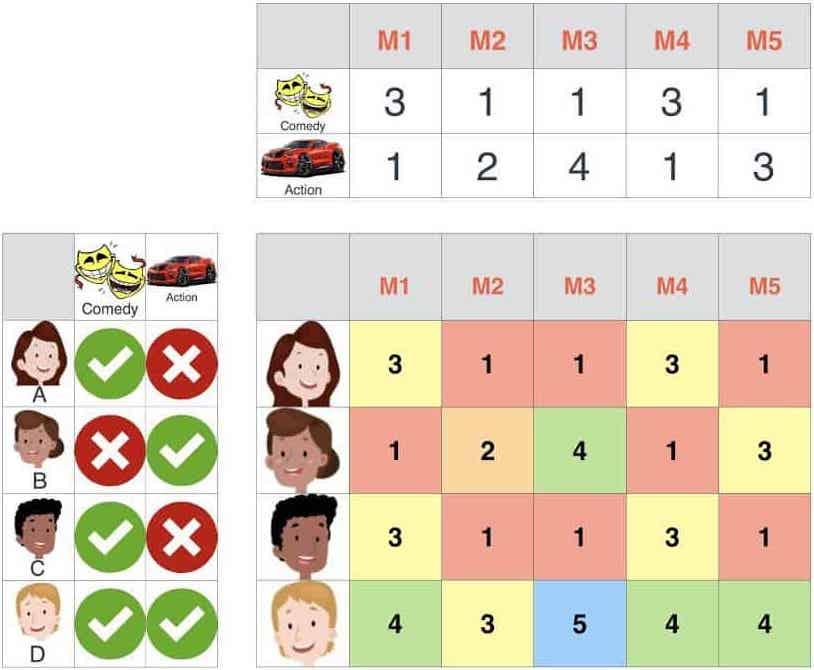
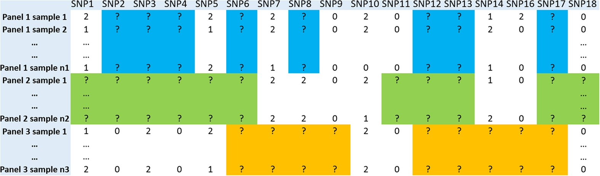

```{r setup, include = FALSE}
source(file.path("..", "R", "util.R"))

required_packages <- c('Matrix', 'Rcpp')
install_and_load_packages(required_packages)

# Print outputs without "##"
knitr::opts_chunk$set(comment = '')
```

# Large-yet-sparse data in modern apps

### Example: online user-behavior data (Netflix, Amazon, online ads, ...)


---

# Large-yet-sparse data in modern apps

### Example: online user-behavior data (Netflix, Amazon, online ads, ...)

_Matrix factorization_ approximates the data matrix $\bm{X}$ through a decomposition
$$\bm{X} \approx \bm{U} \bm{V}^\intercal,  \text{ i.e. } \,  x_{ij} \approx \langle \bm{u}_i, \bm{v}_j \rangle.$$
<!-- (\text{or} \approx \bm{\Lambda} \bm{F}) -->
--


---

# Large-yet-sparse data in modern apps

### Example: online user-behavior data (Netflix, Amazon, online ads, ...)

$$\bm{X} \approx \bm{U} \bm{V}^\intercal,  \text{ i.e. } \,  x_{ij} \approx \langle \bm{u}_i, \bm{v}_j \rangle$$

---

# Large-yet-sparse data in modern apps

### Example: online user-behavior data (Netflix, Amazon, online ads, ...)

Estimates of $\bm{U}, \bm{V}$ are obtained by minimizing

$$\sum_{\text{observed pairs of } (i,j)} \| x_{ij} - \langle \bm{u}, \bm{v} \rangle \|^2 + \sum_i \lambda \| \bm{u}_i \|^2 + \sum_j \lambda \| \bm{v}_j \|^2.$$
 
--

This can be done e.g. by
* alternating least suares, or
* stochastic gradient descent.

--

**Note:** Good idea also to have _column/row bias_ parameters.

---

# Large-yet-sparse data in modern apps

### Example: electronic health/administrative claims data


---

# Large-yet-sparse data in modern apps

### Example: electronic health/administrative claims data


**Case study:** Comparative effectiveness study of thiazide and ACE inhibitors on major cardio-vascular events
* IBM MarketScan Commercial Claims and Encounters
* 1,065,745 patients (28.3% on thiazide)
* 15,779 predictors of potential clinical relevance
* 1.00% non-zero entries in the design matrix

---

# Large-yet-sparse data in modern apps

### Example: Markov random field &mdash; sparsity as modeling assumtpion


---

# Large-yet-sparse data in modern apps

### Example: other types of data from your research? (e.g. genomics?)

![:vspace 2ex]


![:vspace 2ex]

--
**Note:**&thinsp; You could be the first one to write an efficient binary matrix class, supporting common operations!<br> 
$\quad$ (e.g. column dot, pair-wise corr,  matrix-vector, ....)

---

# Disclaimer: focus on data that are $<$ RAM

... because complex calculations become impossible o.w.

---
class: center, middle, inverse

# Data structure for sparse data

---

# Sparse matrix in Triplet/COOrdinate format

`Tsparse` or `COO` formats represent a sparse matrix by storing triplets `(row_index, col_index, value)`:
```{r}
col_index <- c(1, 1, 1, 2, 2, 3)
row_index <- c(1, 3, 5, 2, 4, 1)
val <- c(2, 1.2, 0.5, 2.1, 7, 9)
```

```{r, eval=FALSE}
data.frame(row_index, col_index, val)
```

```{r, echo=FALSE}
spmat_triplet <- as.matrix(data.frame(row_index, col_index, val))
row.names(spmat_triplet) <- rep('', nrow(spmat_triplet))
spmat_triplet
```

---

# Sparse matrix in Triplet/COOrdinate format

`Tsparse` or `COO` formats represent a sparse matrix by storing triplets `(row_index, col_index, value)`:
```{r}
col_index <- c(1, 1, 1, 2, 2, 3)
row_index <- c(1, 3, 5, 2, 4, 1)
val <- c(2, 1.2, 0.5, 2.1, 7, 9)
```

```{r}
sparseMatrix(i = row_index, j = col_index, x = val, repr = "T")
```

---

# Statistical computing with COO format (?)

Common operations: $\bm{v} \to \bm{X} \bm{v}$, extract/dot with non-zero elements of $\bm{X}[, j]$ or $\bm{X}[i, ]$, compute $\bm{X}^\intercal \bm{W} \bm{X}$, etc.

```{r}
X <- sparseMatrix(
  i = row_index, j = col_index, x = val, repr = "T"
)
v <- rnorm(dim(X)[2])
```

--

```{r}
dense_matvec <- function(X, v) {
  result <- rep(0, dim(X)[1])
  for (j in 1:dim(X)[2]) {
    for (i in 1:dim(X)[1]) {
      result[i] <- result[i] + 
        X[i, j] * v[j]
    }
  }
  return(result)
}
```

---

# Statistical computing with COO format (?)

Common operations: $\bm{v} \to \bm{X} \bm{v}$, extract/dot with non-zero elements of $\bm{X}[, j]$ or $\bm{X}[i, ]$, compute $\bm{X} \bm{W} \bm{X}$, etc.

```{r}
X <- sparseMatrix(
  i = row_index, j = col_index, x = val, repr = "T"
)
v <- rnorm(dim(X)[2])
```

```{r}
coo_matvec <- function(X, v) {
  result <- rep(0, dim(X)[1])
  n_nonzero <- length(X@x)
  for (k in 1:n_nonzero) {
    result[X@i[k] + 1] <- result[X@i[k] + 1] + 
      X@x[k] * v[X@j[k] + 1]
  }
  return(result)
}
```

---

# Compressed sparse formats for computing

For hardware-aware (hence more efficient) computing, it's better to store non-zero elements contiguously by row/col.

--

_Compressed Sparse Row/Column_ (CSR/CSC) formats provide such data representation.

![:vspace 1ex]

&nbsp;


---

# Compressed sparse formats for computing

The idea is that all the relevant info can be captured by
![:vspace -.5ex]
* Number of non-zero elements in each row/col
* Indices of non-zero element along row/col
* Values at those indices

```{r}
col_index <- c(1, 1, 1, 2, 2, 3)
row_index <- c(1, 3, 5, 2, 4, 1)
val <- c(2, 1.2, 0.5, 2.1, 7, 9)
X <- sparseMatrix(i = row_index, j = col_index, x = val)
print(X)
```

---

# Compressed sparse formats for computing

The idea is that all the relevant info can be captured by
* Number of non-zero elements in each row/col
```{r}
X@p # Cumsum of non-zero elems per col
```
* Indices of non-zero element along row/col
```{r}
X@i + 1L # Col indices stored in a flattened ("compressed") vector
```
* Values at those indices
```{r}
X@x
```

---

# Compressed sparse formats for computing

The idea is that all the relevant info can be captured by
* Number of non-zero elements in each row/col
```{r}
X@p # Cumsum of non-zero elems per col
```
* Indices of non-zero element along row/col (32-bit int)
```{r}
X@i + 1L # Col indices stored in a flattened ("compressed") vector
```
* Values at those indices (64-bit double)
```{r}
X@x
```

---

# Compressed sparse formats for computing

CSR/CSC format provides efficient access to each row/col:

```{r}
j <- 1
colj_start <- X@p[j] + 1
colj_end <- X@p[j + 1]
```


```{r}
X@i[colj_start:colj_end] + 1L
X@x[colj_start:colj_end] 
```

---

# Right format for right computing purpose

### Example: CSC for $\ell_1$-regularized regression via coordinate descent
**Goal:** Find $\bm{\hat{\beta}}$ that minimizes the regularized likelihood
![:vspace -1ex]
$$\frac{1}{2n} \sum_{i=1}^n (y_i - \bm{x}_i^\intercal \bm{\beta})^2 + \lambda \sum_{j=1}^p |\beta_j|.$$
--
![:vspace -1ex]
_Coordinate descent_ cycles through $\beta_1, \ldots, \beta_p$, minimizing the objective as a function only of $\beta_j$ while $\bm{\beta}_{(-j)}$ fixed:
--
![:vspace -1.5ex]
$$\beta_j \gets \frac{1}{n} \sum_{i=1}^n x_{ij} \big(y_i - \widehat{y}_{(-j), i}\big) \ \text{ where } \ \widehat{y}_{(-j), i} = \sum_{\ell \neq j} x_{i\ell} \beta_\ell,$$

![:vspace -1ex]
followed by soft-thresholding
$\, \beta_j \gets \frac{1}{1 + \lambda} \textrm{sign}(\beta_j)(|\beta_j| - \lambda)_+$.

---

# Sparse matrix multiplication: CSR or CSC?

--

Not sure? Let's just try!

--

We'll use `RcppEigen` to ensure properly optimized code:

```{r}
sourceCpp(file.path("src", "sparse_matvec_eigen.cpp"))
```

```{r, echo=FALSE}
cat(
  readLines(file.path('src', 'sparse_matvec_eigen.cpp'))[7], 
  sep = '\n'
)
cat('\n')
cat(
  readLines(file.path('src', 'sparse_matvec_eigen.cpp'))[24:34], 
  sep = '\n'
)
```

---

# Sparse matrix multiplication: CSR or CSC?

Not sure? Let's just try! 

We'll use `RcppEigen` to ensure properly optimized code:

```{r, eval=FALSE}
sourceCpp(file.path("src", "sparse_matvec_eigen.cpp"))
```

```{r, echo=FALSE}
cat(
  readLines(file.path('src', 'sparse_matvec_eigen.cpp'))[8], 
  sep = '\n'
)
cat('\n')
cat(
  readLines(file.path('src', 'sparse_matvec_eigen.cpp'))[36:46], 
  sep = '\n'
)
```

---

# Sparse matrix multiplication: CSR or CSC?

Not sure? Let's just try! 

We'll use `RcppEigen` to ensure properly optimized code:

```{r, eval=FALSE}
sourceCpp(file.path("src", "sparse_matvec_eigen.cpp"))
```

```{r, echo=FALSE}
cat(
  readLines(file.path('src', 'sparse_matvec_eigen.cpp'))[10:22], 
  sep = '\n'
)
```

---

# Sparse matrix multiplication: CSR or CSC?

```{r}
n_obs <- 10^6
n_pred <- 10^4
X <- simulate_sparse_binary_design(
  n_obs, n_pred, density = .001, repr = 'T'
)
X_csc <- as(X, 'dgCMatrix')
X_csr <- sparseMatrix(
  i = X@i, j = X@j, x = X_csc@x, repr = "R",
  index1 = FALSE # Use 0-based (instead of 1-based) indexing 
)
v <- rnorm(n_pred)
```

--

```{r, eval=FALSE}
bench::mark(csc_eigen_matvec(X_csc, v))
```

```{r, echo=FALSE}
summarize_benchmark(
  bench::mark(csc_eigen_matvec(X_csc, v))
)
```

```{r, eval=FALSE}
bench::mark(csr_eigen_matvec(X_csr, v))
```

```{r, echo=FALSE}
summarize_benchmark(
  bench::mark(csr_eigen_matvec(X_csr, v))
)
```

---

# So, triumph of CSR? 

---

# So, triumph of CSR? Not so fast!

```{r}
n_obs <- 10^4
n_pred <- 10^6
X <- simulate_sparse_binary_design(
  n_obs, n_pred, density = .001, repr = 'T'
)
X_csc <- as(X, 'dgCMatrix')
X_csr <- sparseMatrix(
  i = X@i, j = X@j, x = X_csc@x, repr = "R",
  index1 = FALSE # Use 0-based (instead of 1-based) indexing 
)
v <- rnorm(n_pred)
```

```{r, eval=FALSE}
bench::mark(csc_eigen_matvec(X_csc, v))
```

```{r, echo=FALSE}
summarize_benchmark(
  bench::mark(csc_eigen_matvec(X_csc, v))
)
```

```{r, eval=FALSE}
bench::mark(csr_eigen_matvec(X_csr, v))
```

```{r, echo=FALSE}
summarize_benchmark(
  bench::mark(csr_eigen_matvec(X_csr, v))
)
```

---

# Similar rel performance with transpose

```{r, eval=FALSE}
n_obs <- 10^4
n_pred <- 10^6
X <- simulate_sparse_binary_design(
  n_obs, n_pred, density = .001, repr = 'T'
)
X_csc <- as(X, 'dgCMatrix')
X_csr <- sparseMatrix(
  i = X@i, j = X@j, x = X_csc@x, repr = "R",
  index1 = FALSE # Use 0-based (instead of 1-based) indexing 
)
w <- rnorm(n_obs)
```

```{r, include=FALSE}
w <- rnorm(n_obs)
```

```{r, eval=FALSE}
bench::mark(csc_eigen_matvec(X_csc, w, transposed = TRUE))
```

```{r, echo=FALSE}
summarize_benchmark(
  bench::mark(csc_eigen_matvec(X_csc, w, transposed = TRUE))
)
```

```{r, eval=FALSE}
bench::mark(csr_eigen_matvec(X_csr, w, transposed = TRUE))
```

```{r, echo=FALSE}
summarize_benchmark(
  bench::mark(csr_eigen_matvec(X_csr, w, transposed = TRUE))
)
```

---
class: middle, center, inverse

# Summary & References

---

# Summary

![:vspace 2.5ex]
"Sparse data" are increasingly common in applications.

--

![:vspace 2ex]

Most common formats for storing sparse data:
* Triplet &mdash; intuitive and convenient for construction
* CSR/CSC &mdash; better suited for efficient computing
--

  * Row/column orientation needs to be chosen in an algorithm- and hardware-aware manner.

---

# References


---

# References

